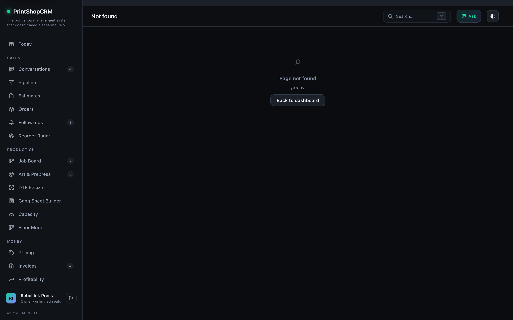
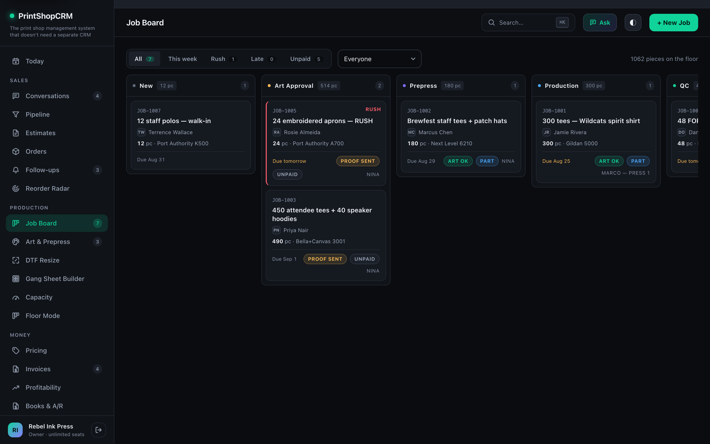
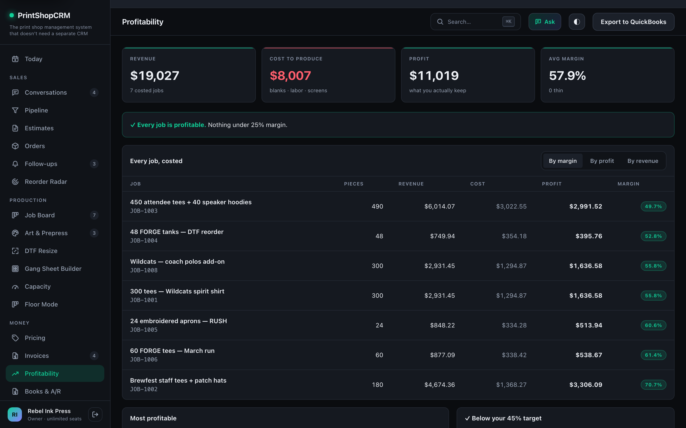
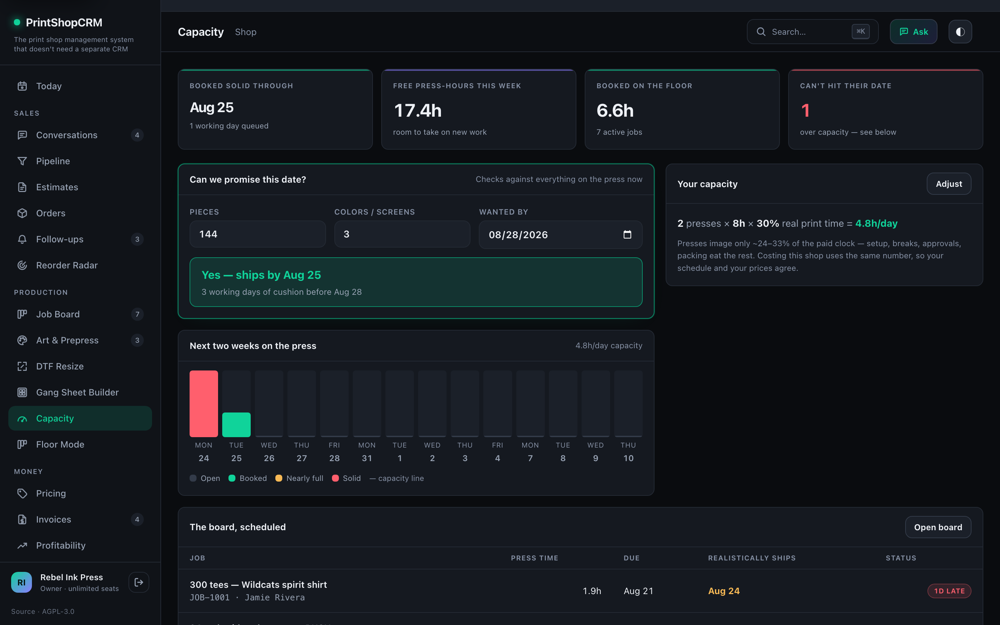
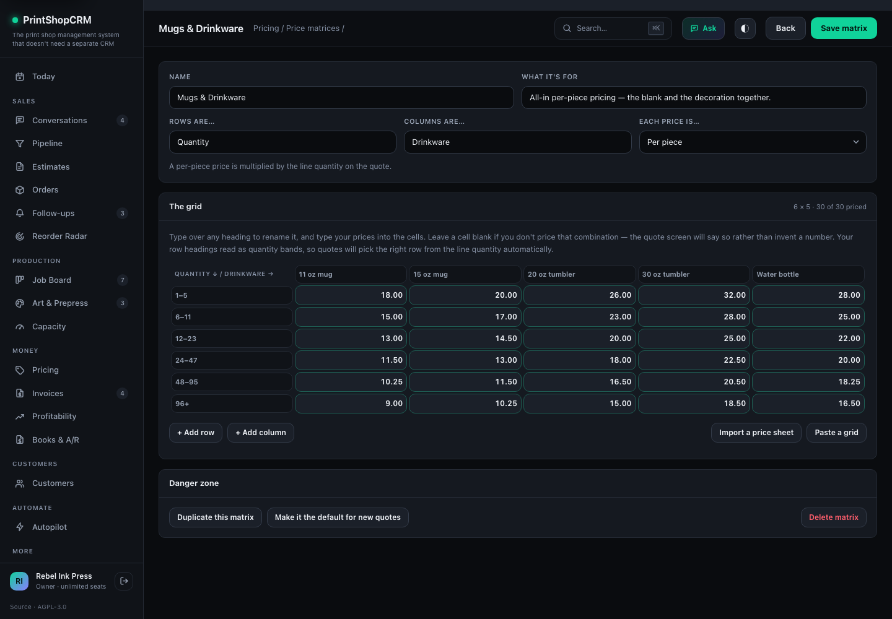

> Community direction: the complete software is free and open source. Optional paid service is
> server hosting and basic setup. [Roadmap](docs/ROADMAP.md) · [Evaluation demo](docs/DEMO.md)

# PrintShopCRM

**Open-source shop management for screen printers, embroiderers, and DTF shops — with the CRM built in.**

Quoting, estimates, invoicing, a production board, art proofing, purchasing, and per-job
profitability in one app. Node.js + SQLite. No build step, four runtime dependencies, and every
shop's data in a plain SQLite file you can copy.

[](https://github.com/ColeLundstrom/printshopcrm/actions/workflows/ci.yml)
[](LICENSE)
[](https://github.com/ColeLundstrom/printshopcrm/pkgs/container/printshopcrm)
[](CONTRIBUTING.md)
[](https://printshopcrm.com/open-source/)
[](https://nodejs.org)

```bash
git clone https://github.com/ColeLundstrom/printshopcrm.git
cd printshopcrm
npm install
npm run seed      # optional: a demo shop mid-week, so the app isn't empty
npm start         # → http://localhost:3333
```

That's the whole install — measured at about 3 seconds on a cold npm cache. No Postgres, no Redis,
no build pipeline, nothing to compile.

Prefer containers?

```bash
docker run -p 3333:3333 -e PSC_AUTH=1 -e PSC_SECRET=$(openssl rand -hex 32) \
  -v printshopcrm-data:/data ghcr.io/colelundstrom/printshopcrm:latest
```

Runs on **Linux, macOS, and Windows** (Node 22.13+), and on x86 or ARM in Docker. Deploying to a
server? See **[deploy/DEPLOY.md](deploy/DEPLOY.md)** for Docker Compose, Fly.io, Render, or a plain
VPS.

---

## Screenshots

|  |  |
|---|---|
|  **Today** — what's at risk, ranked by money |  **Job board** — drag-to-move production kanban |
|  **Profitability** — every job, costed |  **Capacity** — can you actually hit that date? |

---

## Why this exists

Most shop-management tools tell you what you *invoiced*. They don't tell you what you *kept*.

Shops routinely discover they underpriced a job months later, by watching gross revenue. The reason
is structural: a press only actually prints roughly a quarter to a third of the clock — the rest is
setup, approvals, breaks, packing — so costing labor at a raw hourly rate understates it by around
3×. A job can look like 40% margin on paper and lose money in the building.

PrintShopCRM costs every job against your real utilization and tells you **while the price is still
editable**. That's the whole idea. Everything else is the shop-management software you need around
it so that number is based on real data instead of a spreadsheet.

Four more things it does that are unusual:

- **Your price sheet, not ours.** Most shop software ships a pricing model — colours × quantity —
  and every shop that sells something else bends its real prices to fit it. Here you build price
  matrices of your own: name one anything, label the rows and columns in your own words, type your
  prices in. A mug shop prices by mug size, an engraver by engraved area, and neither has to pretend
  to be a screen printer. See [Price matrices](#price-matrices).

- **Turnaround starts at art approval, so the schedule does too.** Your terms say "10 business days
  from proof approval." Most tools store a due date typed at intake that never moves — a proof
  sitting in an inbox for four days silently eats four days of production. Here, approval-gated jobs
  recompute their own due date and the dashboard surfaces deadlines that have already slipped.
- **Per-size pricing is a first-class object.** The size grid carries real per-size upcharges and
  flows estimate → job → work ticket → PDF → export. Quantity is *derived* from the grid, so the two
  can never disagree.
- **Your data is not the moat.** Customers, quotes, invoices, payments, jobs, artwork history and
  the timeline each export to CSV — including line items with size breakdowns, which nobody else
  gives you — and **everything**, every table, exports as one JSON file. No ticket, no fee. The
  data for each shop is a plain SQLite file you can copy — see INSTALL.md for what a backup has to
  include, because a multi-tenant install has more than one of them.

---

### Further reading

Longer write-ups of the things people ask about most, on the project site:

- [What you get, what self-hosting takes, and the catch stated plainly](https://printshopcrm.com/open-source/)
- [Is it really free? Where the money actually goes](https://printshopcrm.com/services/free-print-shop-software/)
- [Self-hosting: stack, install paths, and the persistent-volume trap](https://printshopcrm.com/services/self-hosted-print-shop-software/)
- [Switching from Printavo without risking the shop](https://printshopcrm.com/services/switching-from-printavo/)

## Features

Read the [core readiness and remaining gaps](docs/CORE-READINESS.md) before evaluating a migration. Available screens, tested local behavior and verified provider integrations are different levels of readiness.

**Sales**
- Customers with billing/shipping addresses, tags, notes, lifetime value, and a timeline fed by other modules
- Estimates with a size/color matrix, per-size upcharges, live totals, PDF, and a no-login customer approval link. Commercial revisions expire the old approval link, preserve approval history, and require another review
- Sales pipeline with weighted value and win rate, auto-synced from estimate events
- Conversation history for outbound email/SMS and connected inbound messages; SMTP alone does not synchronize a mailbox. Unsent drafts stay with their customer while navigating
- Follow-ups: quotes that went quiet and invoices nobody chased, ranked by value
- Reorder Radar: customers due for their next run, based on their own history

**Production**
- Drag-to-move job board (pointer-based, works on touch) with rush/late/unpaid/assignee filters
- Art & prepress: versioned proofs, customer approve/reject with notes, approval advances the job *and* moves the due date
- Printable work tickets with a hard "NO APPROVED ART — do not print" block when the proof isn't signed off
- Screenprinting capacity estimates; review decoration and machine assumptions before promising delivery
- Floor Mode: Code 128 barcode scanning that feeds measured labor back into costing
- DTF resize and a gang-sheet builder (embeddable on your own site, checking out through your Stripe or Authorize.net account)

**Money**
- Quoting calculator: garment × markup + imprint charge scaled by run length and colors-per-location + one-time screens; tiered rush; dark garments automatically add an underbase
- Custom price matrices: any number of price sheets with **your own name, rows, and columns** — screen printing by ink colour, mugs by size, engraving by area, rush fees by turnaround. Import a CSV, duplicate a sheet to make a variant, and choose which matrix prices each line of a quote (one estimate can use several). Seven starter templates to edit or ignore
- Per-cell overrides on the built-in calculator too — type your real price into any cell and it wins
- Invoices with partial payments, running balance, saved postal addresses, and separate payment/production deadlines
- Stripe and Authorize.net hosted checkout with signed callbacks, test-mode isolation, refund/void reconciliation and explicit invoice credits ([setup and limits](docs/PAYMENTS.md))
- Per-job and shop-wide profitability with cost breakdown and $/productive-hour
- Books & A/R: aging buckets and customer statements
- QuickBooks IIF export (Online sync is API-only for now — it has no setup screen yet)

**Purchasing**
- Garment catalog with editable baseline costs feeding the ROI estimates
- S&S Activewear, SanMar and AlphaBroder lookups when you connect an account, catalog fallback when you don't
- Purchase orders grouped by style/color/size, with partial receiving and explicit supplier-confirmation records. The current catalog does not provide verified orderable size/color SKUs: place orders in the supplier portal and record their reference here

**Automation & integration**
- Event and time-based rules with multi-step drip sequences (email → wait → text)
- Autopilot: paste a customer email and it becomes a structured draft order — review-first by default
- AI receptionist for inbound quote requests (bring your own Anthropic or OpenAI key; a deterministic parser runs with no key at all)
- Public REST API (`/api/v1`) with Bearer keys, plus signed outbound webhooks — see [docs/API.md](docs/API.md)
- CSV mapping for customers and supported order-history fields, with preview; check unsupported attachments and payment history separately before migrating

**The app itself**
- Light and dark themes, tuned separately rather than inverted
- ⌘K command palette, full keyboard navigation, undo-instead-of-confirm on reversible actions
- A sidebar that starts with the daily loop — quote → produce → invoice → get paid — and folds the
  power tools behind one click, so the first screen isn't 27 destinations deep
- Multi-tenant mode: one isolated SQLite database per shop, real staff logins with owner/manager/staff roles
- PWA — installable, works on a shop-floor tablet

---

## Price matrices

**Pricing → Your matrices.**

A price matrix is your own price sheet. It has no built-in meaning: you name it, you write the row
and column headings, and you type the prices. That is deliberate — the moment software decides that
pricing means "quantity × ink colours", every shop that sells anything else has to lie to it.



*A mug shop's price sheet. Nothing about this grid is screen printing, and nothing had to be.*

| | |
|---|---|
| **Name** | Anything. `Screen Printing`, `Mug Printing`, `Laser Engraving`, `Hat Embroidery`, `Rush Fees`, `2026 Wholesale`. |
| **Rows** | Any labels. Quantity bands (`1–11`, `48–71`, `500+`), or `Same day` / `2–3 days`, or `Small` / `Medium` / `Large`. |
| **Columns** | Any labels. `1 colour`…`6 colours`, or `11 oz mug` / `20 oz tumbler`, or `Front` / `Back` / `Both sides`. |
| **Cells** | The prices. A blank cell means *we don't price that combination* — quotes say so rather than invent a number. |
| **Each price is** | **Per piece** (multiplied by the line quantity) or a **flat charge** (the whole line, whatever the quantity — right for setup, art and rush fees). |

What you can do with them:

- **Create** as many as you like, from scratch or from a starter template
- **Edit** every heading and every price; add or delete rows and columns at any time
- **Duplicate** one to make a variant — a wholesale sheet, a second brand, next year's prices
- **Import** a CSV or paste a grid straight out of your spreadsheet; your headings come through as
  text, not mangled into numbers
- **Set a default** that new quotes start on
- **Delete** one — estimates already priced from it keep their prices

### On a quote

Every line of an estimate can be priced from a *different* matrix, so one quote can mix screen
printing on the tees, embroidery on the caps, and your mug sheet for the giveaway mugs. Click the ▦
next to a line's rate (or **▦ From a price matrix** to add a new line), pick the matrix, row and
column, and the price fills in. The matrix a line came from is recorded on the estimate, so you can
trace a number back to the sheet that produced it.

If your row headings read like quantity bands — `1–11`, `12–23`, `500+`, `up to 24` — the picker
selects the right row from the line's quantity on its own. Rows that aren't quantities (`Large`,
`Both sides`) simply don't get that, and work exactly the same otherwise.

### Starter templates

Screen Printing · DTF Transfers · Embroidery · Heat Press & Vinyl · Mugs & Drinkware · Custom
Patches · Laser Engraving — plus a blank grid.

These are **starting points, not rules**. Importing one gives you your own copy with real,
defensible numbers so you can quote on day one; rename it, restructure it, and overwrite every price.
Nothing links back to the template.

### Where they live

One `price_matrices` row per matrix, in your shop's own SQLite database. The grid is stored dense and
positional (`cells[row][col]`), so renaming a column or reordering rows can never orphan a price. The
engine is [`lib/matrices.mjs`](lib/matrices.mjs) and the REST surface is `/api/matrices` — see
[docs/API.md](docs/API.md).

---

## Self-hosting

Full instructions — Node install, nginx reverse proxy, SSL, systemd unit, backups, upgrades — are in
**[INSTALL.md](INSTALL.md)**.

The short version for a Linux box:

```bash
git clone https://github.com/ColeLundstrom/printshopcrm.git /opt/printshopcrm
cd /opt/printshopcrm
npm ci --omit=dev

# .env.example points PSC_DB at /var/lib/printshopcrm, deliberately — OUTSIDE the checkout, so an
# upgrade that replaces the code cannot touch your data. Make it first, or the next line copies in
# a path this user cannot write and the server exits before it listens.
sudo mkdir -p /var/lib/printshopcrm/uploads
sudo chown -R "$USER":"$USER" /var/lib/printshopcrm   # or the service account, if you made one

cp .env.example .env        # then edit it — PSC_SECRET is required
chmod 600 .env              # it holds PSC_SECRET and every API key; cp leaves it world-readable
npm start                   # reads .env; `node server.mjs` does NOT
```

Put nginx in front of it, point a domain at the box, run certbot, and install the systemd unit from
[`deploy/printshopcrm.service`](deploy/printshopcrm.service). INSTALL.md has all of it verbatim.

### Single shop vs. multi-tenant

| | |
|---|---|
| **Single shop** (default) | One database, no login. Fine behind your own network or a reverse-proxy auth layer. |
| **Multi-tenant** (`PSC_AUTH=1`) | Signup, staff logins with roles, and a separate isolated SQLite database per shop. Use this for anything reachable from the internet. |

Set `PSC_SECRET` in production either way — customer share links derive from it.

### Configuration

Everything is environment variables plus per-shop settings stored in the database. Nothing is
hardcoded. See **[.env.example](.env.example)** for every variable with comments, and Settings
inside the app for per-shop values (tax rate, hourly rate, mail, supplier accounts, payment providers).

**Currency and number format are per-shop settings too** (Settings → Shop). Pick an ISO currency
code and a locale, and every screen, PDF, email, customer page and the assistant write money and
dates that way — `£1,234.50` and `28 Aug` for a shop in Manchester, `1.234,50 €` in Berlin. The
default is USD / en-US, which is what the app always did, so an existing install changes nothing.
One shop, one currency; per-customer currencies are deliberately out of scope.

Secrets stored in settings are redacted out of any response sent to the browser.

---

## Hosted option

Self-hosting is fully supported and always will be — this repo is the whole product, not a teaser,
and running it for your own shop is free forever.

If you'd rather not run a server, **managed hosting and setup are available**: backups, updates,
SSL, monitoring, and data migration off your current tool — including on-site setup and training.
See **[HOSTING.md](HOSTING.md)** or **[printshopcrm.com](https://printshopcrm.com/)**.

That's the deal, plainly: the software is free and always will be, and paying us buys operations —
not features. Hosted and self-hosted run identical code.

---

## Running it day to day

```bash
npm run admin                                     # what the admin tool can do
npm run admin -- list-shops                       # shops and their owners
npm run admin -- reset-password owner@shop.com    # set a password with no email involved
```

That last one is the way out of a lockout. Password reset normally goes by email, and a fresh
install has none configured — so anyone with server access can recover an account directly. It
grants no privilege they didn't already have, since the databases are right there on disk.

## Tests

```bash
npm test           # 90+ unit tests, no network, runs in seconds
npm run test:e2e   # 70+ end-to-end checks against a throwaway database
npm run test:all   # both
```

Pure Node, no test framework and no shell dependencies — they run identically on Linux, macOS, and
Windows. CI runs both on Node 22 and current LTS, on Ubuntu and Windows, plus a Docker build that
boots the container and checks the data volume survives a container replacement.

Both must pass before a release. See [CONTRIBUTING.md](CONTRIBUTING.md).

---

## How it fits together

```
server.mjs                    routes, static serving, customer-facing pages
lib/db.mjs                    schema, migrations, settings, scheduling
lib/tenants.mjs               multi-tenant control plane (registry, members, sessions)
lib/pdf.mjs                   PDF writer — no dependency, writes the bytes directly
lib/roi.mjs                   job costing and margin
lib/capacity.mjs              press-time scheduling
public/js/shared/pricing.js   pricing + costing, imported by BOTH server and browser
public/js/views/              one file per screen
bin/gate.mjs                  the test suite
```

Two design rules worth knowing before you change anything:

- **`public/js/shared/pricing.js` is imported by both sides** — the browser as a module URL, the
  server as a file path. The total shown in the editor is computed by the same code that writes the
  invoice, so money cannot drift between them.
- **Invoice status is always derived** from the payments table via `syncInvoiceStatus()`, never set
  by hand. Delete a payment and the invoice correctly reopens.

Customer links (`/p/estimate/:id`, `/p/art/:id`) are unguessable HMAC tokens compared in constant
time and marked `noindex`; no account required. Work tickets (`/p/ticket/:id`) are internal-only —
they carry costs and staff notes and are never sent out.

Multi-tenant isolation uses `AsyncLocalStorage`: the request gate resolves a session to its shop and
runs the entire request inside that shop's database, so no query in the app needs a `shop_id` and
one shop cannot reach another's data.

---

## Requirements

- **Node.js 22 or newer** — uses the built-in `node:sqlite` module, so there is no native SQLite
  build step and nothing to compile.
- That's it. Four runtime dependencies: `express`, `multer`, `nodemailer`, `ws`.

Runs on Linux, macOS, and Windows — all three are exercised by CI on every push. Or skip Node
entirely and use the container image, published for `linux/amd64` and `linux/arm64`:

```bash
docker pull ghcr.io/colelundstrom/printshopcrm:latest
```

For reference, the production install this is developed against serves 14 shops in about **40 MB of
RAM** on a small VPS.

---

## Contributing

**This project wants a community, and shop owners count as contributors.**

The hardest thing to get right here isn't the code — it's modelling how shops actually quote,
schedule, and cost work. That knowledge lives in print shops, not in repositories. If something in
here doesn't match how your shop works, [open an issue and say
so](https://github.com/ColeLundstrom/printshopcrm/issues/new/choose). There's a template for exactly
that, and it needs no code.

Also wanted: more supplier integrations, more decoration methods (sublimation, vinyl, patches and
laser are thin), translations, and anything labelled
[`good first issue`](https://github.com/ColeLundstrom/printshopcrm/labels/good%20first%20issue).

Read [CONTRIBUTING.md](CONTRIBUTING.md) before a code PR — it covers the setup, the house rules, and
the one hard rule: **a bug fix needs a failing test first.** Planning something large? Open a
[discussion](https://github.com/ColeLundstrom/printshopcrm/discussions) first so it doesn't sit.

**[GOVERNANCE.md](GOVERNANCE.md) explains how the project is maintained**: who reviews changes,
response targets, merge requirements, funding and continuity. Response targets depend on
maintainer availability; voluntary support does not buy a response deadline or review priority.

By contributing you agree to the [Code of Conduct](CODE_OF_CONDUCT.md).

Security issues: please report privately, see [SECURITY.md](SECURITY.md).

### Support the project

Voluntary contributions help fund maintenance, documentation, release testing and outside
contributors as more shops join. The software stays fully available for free. Contributions
do not buy features, merge priority or a support contract; paid hosting and basic setup are
separate services.

Open **More tools → Support the project** for configured one-time or recurring options.
Payment links stay hidden until the operator sets up and verifies a destination. You can also
help by testing releases, improving documentation, reporting bugs and contributing code.
See [project support setup](docs/PROJECT-SUPPORT.md).

## License

**GNU AGPL v3 or later** — see [LICENSE](LICENSE). You can run, modify and share PrintShopCRM,
including commercially, under the license's terms. [Hosting and basic setup](HOSTING.md) are
optional paid services; voluntary project support does not unlock software features.

If you modify the software and users interact with it remotely over a computer network,
[AGPL §13](https://www.gnu.org/licenses/agpl-3.0.en.html#section13) requires a prominent offer of
your version's **Corresponding Source**, available from a network server at no charge. This
includes the program source and required build, installation and modification scripts, not your
customer records or credentials. Sharing copies also carries the applicable license obligations.
Contributing changes upstream is welcome; §13 does not require submission to this project.

For a modified deployment, set `PSC_SOURCE_URL` to an accessible source archive or repository
identifying the exact version running, including your changes. Keep that source offer current.
The app's source link helps provide the offer; setting the URL alone does not establish compliance.

### A guided workspace, with AI optional

Open **Setup & connections** for shop basics, CSV migration, email on your domain, Twilio SMS, and optional Slack/agent connections. Daily work remains manual unless you choose assistance. Specialist tools remain under **More tools** and all settings remain editable. See [connection setup](docs/CONNECTIONS.md) and [migration limits and checks](docs/MIGRATION.md).
